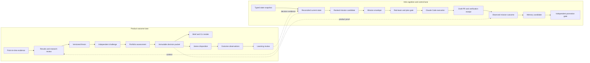

# ASXOS outcome engine and Arbi second-brain execution plan

**Status:** queued after existing remediation by James on 2026-08-12; planning authority only
**Prepared:** 2026-08-12 (Australia/Brisbane)
**Observed repository base:** `main@8037137e3de3dfd576d51fb0905adbf5ffe7f2b1`
**North star:** `docs/product/target-architecture.md`
**Canonical queue:** `docs/product/roadmap-state.md`
**Governor:** James
**Programme controller:** Arbi
**Execution lead:** Guilfoyle
**Implementation executor:** Claude Code or the attended `claude-execute.yml` harness
**Delivery ceiling for this packet:** documentation and planning only

This packet turns the two proposed missions - Model A retirement and results-to-thesis - into
an executable programme, then carries that programme through one real governed investment case,
a useful brief, and an outcome-learning loop. It gives the Arbi second brain the same treatment:
an architecture, bounded missions, typed artifacts, acceptance evidence, and a sequenced backlog.

It deliberately does not amend authority, apply a migration, create credentials, mutate
production, produce a capital instruction, or create a competing roadmap. James placed this
programme after the existing remediation queue on 2026-08-12. That placement does not grant a
blanket implementation window: when the entry gate clears, Arbi must select one work order into
`roadmap-state.md` as the one live next action and apply the existing mission gates.

---

## 1. Executive decision

The correct path is not to make the current email larger. The email is thin because ASXOS does
not yet have one admitted, real-data investment decision object for it to render. A better
template cannot supply missing evidence, challenge, portfolio context, decision state, or outcome
truth.

Build two coordinated lanes:

1. **Product outcome lane:** retire Model A from active decision surfaces, add a governed
   results-to-thesis path, complete the canonical evidence and research foundations, run one real
   paper-only case end to end, render the exact packet, record James's disposition, and observe
   outcomes at the governed horizons.
2. **Arbi cognition lane:** replace manually reconstructed and stale context with typed live-state
   snapshots, a derived current-state projection, a mission registry, compact context manifests,
   executable evaluations, outcome receipts, and reviewed memory promotion.

Arbi should become more capable by knowing the project more accurately and handing work to Claude
Code more reliably. It should not become more powerful by receiving broader credentials,
production mutation, merge, deploy, or capital authority.

The first proof of success is:

```text
real ASX result
  -> frozen evidence
  -> results review
  -> thesis revision
  -> independent challenge
  -> portfolio assessment
  -> immutable decision packet
  -> exact brief
  -> James disposition
  -> 21/63/126-session observations
  -> process and outcome learning
```

The second-brain proof is that Arbi can select and brief that work from fresh, cited state; Claude
Code can execute the approved mission without inventing scope; and the observed result updates
future prioritisation without allowing Arbi to promote its own conclusions.

---

## 2. Current position and constraints

### 2.1 What exists

- The target architecture is ratified and Stage 0 is complete.
- The reviewed decision-engine prototype is on `main`. Its strict decision contracts and
  synthetic controls are adopted as an architecture boundary, not as proof of a real-data engine.
- The prototype is read-only and synthetic. It does not prove real evidence admission,
  persistence, delivery, disposition, benchmark measurement, or learning.
- The existing brief remains an operational/status surface. The roadmap records that V2 is dark;
  merely enabling it would expose a generic collector layout, not the packet-first product.
- Model A is shelved by policy but still has active runtime, scheduler, API, reviewer, command,
  test, and documentation residue. Historical evidence must remain auditable while active
  authority and execution paths are removed.
- Arbi has a constitution, authority ladder, permission model, manual scorecard, manual golden
  scenarios, git-native memory paths, commands, guards, and an attended Claude Execute harness.
- Arbi's project state and memory are mostly hand-maintained prose. Several current documents mix
  current state with historical snapshots, and several memory/eval claims have not been refreshed
  since July.

### 2.2 Canonical constraints

- `roadmap-state.md` remains the single live queue. This proposal is a work-order factory, not a
  second queue.
- Stage 1 evidence work, Stage 2 research registry, and Stage 3 candidate admission cannot be
  silently skipped because a synthetic Stage 4 contract exists.
- James must complete the capital/risk calibration before Stage 4.
- XJOAI is the benchmark. If licensed total-return history is unavailable, benchmark measurement
  is `unavailable`; no proxy may inherit the label.
- Outcomes use 21, 63, and 126 trading sessions. Packet expiry uses the ratified 5/21-session
  rules and earlier material-event invalidation.
- Dagster is the target scheduler and S3 in `ap-southeast-2` is the target immutable object store.
  Their deployment, cost, credentials, and cutover require separate approved work orders.
- No new GitHub production schedule, no Model A capital input, no broker execution, no production
  mutation, and no hidden LLM-generated capital number.
- The personal-advice firewall remains binding. Early user states are `watch`, `revise`, or
  `abstain`; action labels and sizing require the canonical Stage 4 gates and James's calibration.

### 2.3 Recency rule

Every implementation mission must re-freeze its base SHA and live probes before work starts.
Repository observations in this packet are evidence at `8037137`, not permanent facts. A live
claim without `observed_at`, source, and unavailable/error state is not admissible second-brain
input.

### 2.4 Queue placement

James queued this programme after the existing remediation work on 2026-08-12. The entry gate is:

1. every live remediation/defect row ahead of this programme is completed, explicitly deferred by
   James, or superseded with cited evidence;
2. merged fixes have their required production or scheduled-run observations recorded;
3. `roadmap-state.md` is refreshed against the then-current `main` and live probes; and
4. `/arbi` selects exactly one unblocked item from this packet as THE ONE THING.

The default first item after that gate is `P1-01`. The default next candidate is `SB0-01`.
Parallel execution requires a direct James instruction naming both mission IDs. Detailed order and
proof requirements live in sections 6-8 of this packet; they are referenced by the canonical
roadmap rather than copied into another backlog.

---

## 3. Programme architecture



### 3.1 Product object rule

Reuse and reconcile the adopted `asxos/domain/decision_engine/types.py` contracts. Do not create a
parallel investment object family because a skill or agent prefers different names. A proposed
artifact must either:

1. project an existing canonical object;
2. extend it through a versioned, reviewed contract change; or
3. prove a consumer requirement that existing contracts cannot express.

The results path may introduce a `ResultsReviewArtifact`, but it is an analysis input to a
`ThesisVersion`; it is not a second decision packet and does not mutate a thesis by itself.

### 3.2 Arbi object rule

Start git-native and file-backed. No vector database, hosted memory plane, or persistent agent
daemon is required to prove the loop. The logical artifacts are:

| Artifact | Purpose | Trust and write rule |
|---|---|---|
| `ProjectStateSnapshot` | Timestamped observations from repo, GitHub, CI, scheduler, and read-only data probes | Generated read-only; each field carries source, freshness, and error/unavailable state |
| `CurrentStateProjection` | Deterministic reduction of snapshots and durable events into current claims | Generated; never hand-edited as authority |
| `MissionEnvelope` | Exact objective, scope, dependencies, boundaries, acceptance, and stop conditions | Proposed by Arbi; approved by James or the existing attended mission gate |
| `MissionReceipt` | Base/head identities, files, tests, checks, PR, blockers, and readiness | Produced by Claude Code; independently verifiable |
| `OutcomeRecord` | What actually happened after merge, deployment, scheduled run, or user disposition | Append-only observation; never inferred from a green PR alone |
| `ContextManifest` | Minimal cited context required for one mission | Generated from authority and mission dependencies; no giant memory dump |
| `MemoryCandidate` | A proposed durable lesson with provenance, confidence, expiry, and falsifier | Untrusted until reviewed |
| `PromotionRecord` | Eval delta, reviewer identity, accepted/rejected decision, and supersession | James/reviewer-controlled; producer cannot self-promote |

These logical roles do not imply one table per object. JSON schemas and deterministic CLI output
are sufficient for the first proof.

---

## 4. Product outcome lane

The first two missions are the previously discussed work. The later missions show where they lead.
Mission completion never means stage completion unless every canonical stage gate is met.

### P1 - Retire Model A from active operation

**Objective:** make the live product and all decision-support surfaces model-independent while
preserving historical data, migrations, and audit evidence.

**Why first:** a shelved engine that remains wired into startup, jobs, schedules, reviewers, and
commands creates false authority and makes every later contract reconciliation harder.

**Route:** `/arbi-team`; this is a whole-repository, parallel retirement mission.

**Suggested team topology:**

| Teammate | Owned area | Required artifact |
|---|---|---|
| Runtime owner | `asxos/api`, active domain/application imports, jobs, CLI | Runtime removal map and tested implementation |
| Scheduling/operations owner | GitHub workflows, `render.yaml`, operational runbooks | Single inventory of removed, retained, and historical schedules |
| Decision-surface owner | `.claude` commands/agents/skills and portfolio-review semantics | Model-independent status and evidence vocabulary |
| Verification owner | Tests, repository search allowlist, retention/audit review | Adversarial proof that only approved historical references remain |

**Required work:**

1. Build a machine-checkable inventory of every Model A reference and classify it `ACTIVE_REMOVE`,
   `ADAPT`, `HISTORICAL_KEEP`, or `MIGRATION_KEEP`.
2. Remove API warmup and active runtime dependencies.
3. Remove or disable legacy jobs and schedules without deleting historical execution evidence.
4. Rewrite portfolio/review surfaces around evidence quality, thesis coherence, constraints, and
   missing data. Valid states are `CLEAR`, `ATTENTION`, `BLOCKED`, and `EVIDENCE_THIN`, not a
   synthetic buy/add/trim/exit signal.
5. Replace fallback assumptions such as model-derived quantity or cost-base values with explicit
   unknown/unavailable states.
6. Add a repository assertion that fails if a new active Model A reference appears outside the
   reviewed historical allowlist.
7. Supersede stale docs; do not rewrite migrations, old run receipts, or the decay analysis.

**Acceptance:**

- production startup and supported CLI paths do not load a Model A artifact;
- no active scheduler invokes a Model A job;
- no agent, command, brief, or decision basis asks for or interprets an active Model A signal;
- all retained references are classified and justified;
- focused tests, full check, and repository assertions pass; and
- independent review confirms no data-history destruction or advice-boundary regression.

**PR shape:** use independently reviewable runtime/scheduler and agent/surface PRs if file ownership
or risk makes one PR too broad. The approved team plan must name the split before implementation.

**Non-goals:** dropping signal tables, rewriting historical migrations, deleting audit records,
claiming the strategy never existed, or replacing Model A with another ranking model.

### P2 - Results-to-thesis analysis path

**Objective:** turn one ASX results announcement and existing read-only ASXOS evidence into a
reproducible, challenged thesis-revision artifact without persisting, recommending, or trading.

**Route:** `/arbi-team`; this crosses domain contracts, adapters, agent skills, finance review, and
executable evaluation.

**Suggested team topology:**

| Teammate | Owned area | Required artifact |
|---|---|---|
| Contract/adapter owner | Decision-engine adapter and results-review domain code | Deterministic evidence context and review artifact |
| Finance-method owner | Local skills, reviewer/challenger agents, command surface | Source policy, review procedure, and bounded qualitative prompts |
| Eval owner | Fixtures, tests, adversarial documents, reproducibility checks | Hard-gate evaluation suite |
| Independent reviewer | No implementation ownership | Finance, citation, prompt-injection, and personal-advice verdict |

**Skill integration rule:** borrow methods, not authority. Existing finance skills should be
compared against ASXOS contracts and selectively adapted:

| Finance capability | Useful ASXOS contribution | Do not import |
|---|---|---|
| Financial-statement analysis | Statement relationships, statutory/underlying separation, period and unit discipline | Generic prose without source identity or cutoff |
| Variance analysis | Revenue/margin/cash/guidance bridges and driver decomposition | Unreconciled percentage claims or forecast invention |
| Reconciliation | Conflicting source resolution and tie-out procedures | Accounting-system write paths |
| Audit support | Evidence lineage, completeness, control exceptions, reviewer independence | SOX-specific ceremony with no product consumer |
| Data validation/statistics | Numeric exactness, missingness, outlier and reproducibility checks | LLM-generated capital numbers or unsupported significance claims |
| Journal entry/close management | Little direct value for investment review | Entire workflows unless a later accounting consumer is proven |

The local implementation must not require a runtime plugin to remain available. The durable value
is the source policy, deterministic adapter, local tests, and evaluation rubric.

**Source hierarchy:** ASX announcement and audited statements first; issuer presentation second;
complete transcript where lawfully available; reconciled ASXOS PIT records; licensed consensus
only when provenance and rights are explicit; news is contextual and never load-bearing.

**Required work:**

1. Freeze the document, security identity, reporting period, currency, units, knowledge cutoff,
   source hashes, and ASXOS evidence snapshot.
2. Perform all arithmetic with deterministic Decimal/currency/period logic.
3. Reconcile statutory versus underlying metrics and explain every adjustment.
4. Produce metric deltas, cash and balance-sheet changes, guidance changes, thesis-pillar effects,
   catalysts, falsifiers, conflicts, and missing evidence.
5. Run an independent finance challenge that can force revision or abstention.
6. Return `complete`, `revise`, or `abstain`; do not return a rating, price target, trade, or
   position-size instruction.
7. Render JSON and Markdown from the same validated artifact.

**Acceptance:** 100% deterministic numeric checks, 100% material-claim citations, no post-cutoff
evidence, stable hashes for identical input, explicit conflicts, prompt-injection resistance,
successful abstention on incomplete evidence, and no production write or thesis mutation.

**Stop:** present the artifact, reuse/gap report, and eval result to James. A separate work order
must authorise any thesis revision persistence.

### P3 - Complete the evidence foundation (canonical Stage 1)

**Objective:** make evidence immutable, point-in-time correct, replayable, restorable, and
observable before it can enter a decision.

**Key increments:**

1. finish the remaining destructive-loss and PIT coverage work;
2. define evidence admission, quality, staleness, source identity, and unavailable states;
3. write and approve the Dagster deployment/cost/cutover work order;
4. write and approve the S3 credentials/Object Lock/lifecycle/restore work order;
5. prove one evidence packet can be reconstructed at an historical cutoff; and
6. prove a restore and replay without silent substitutions.

**Route:** bounded `/arbi-mission` increments. Credentials, bucket creation, scheduler cutover,
production mutation, and irreversible writes stop for James.

**Acceptance:** the Stage 1 criteria in `target-architecture.md`, not completion of P2 alone.

### P4 - Research registry and candidate admission (canonical Stages 2-3)

**Objective:** retain hypotheses, variants, failures, evaluations, themes, and candidate snapshots
with reproducible identities and no Model A dependency.

**Key increments:** method-agnostic research registry; reproducibility receipt; failed-variant
retention; multiple-testing and leakage controls; theme evidence; candidate snapshot; eligibility
gates; and one admitted ordinary ASX equity candidate.

**Acceptance:** a candidate can be traced to a registered question, exact evidence, evaluation,
failed alternatives, theme context, and eligibility state. Candidate admission does not imply a
capital recommendation.

### P5 - One governed real investment case (canonical Stage 4)

**Entry gates:** Stages 1-3 accepted; James completes the capital/risk calibration; an ordinary
ASX equity with a recent result is selected; benchmark availability is explicit.

**Objective:** connect the adopted contracts and P2 analysis into one paper-only case:

```text
CandidateSnapshot
  -> EvidencePacket
  -> ResultsReviewArtifact
  -> ThesisVersion
  -> ChallengeResult
  -> PortfolioAssessment
  -> DecisionPacket
  -> James disposition
```

**Acceptance:** every identity and citation resolves; missing/stale/unknown inputs block action;
challenge can change the state; tax and portfolio references are typed; packet expiry is valid;
JSON and human render agree; and the case stops before broker execution.

Before Stage 4 gates clear, the same adapters may be exercised only as a historical read-only
reconstruction ending in `watch`, `revise`, or `abstain`. That exercise is integration evidence,
not Stage 4 completion.

### P6 - Packet-first brief and disposition

**Objective:** replace the current status-first email with a pure renderer of admitted decision and
monitoring objects.

The primary brief for a case should answer:

1. what changed;
2. which reported figures changed and where they came from;
3. why the change matters to the thesis;
4. what the independent challenger found;
5. which evidence or portfolio constraints are unresolved;
6. which catalysts and falsifiers now matter;
7. the exact decision state and expiry; and
8. the one disposition James can record against the packet hash.

Operational failures appear only when they affect evidence or delivery integrity. Empty sections
are omitted. The renderer contains no finance or sizing calculations. Do not enable the existing
V2 flag as a substitute for this mission.

**Acceptance:** CLI/API/email render the same admitted identity; a delivery receipt proves the
exact bytes and recipient state; James's response is separate and points to the exact packet; and
delivery retry cannot duplicate disposition or mutate the packet.

### P7 - Outcome and learning loop (canonical Stage 5)

**Objective:** observe what happened without rewriting what was known or rewarding noise.

Record 21/63/126-session security return, XJOAI total return or explicit unavailability, global
sleeve separation, FX/cost/tax assumptions where relevant, portfolio contribution, thesis events,
and invalidation timing. Grade process separately from financial outcome:

- evidence quality and cutoff compliance;
- thesis and challenge quality;
- sizing/timing process adherence;
- James disposition and later revisions;
- security and benchmark outcome; and
- lessons that should change the next research or decision process.

Early learning is descriptive process audit, not statistical proof of edge. A profitable bad
process is not automatically promoted; a loss with correctly identified risk is not automatically
a process failure.

### P8 - Portfolio scale and surface cutover (canonical Stage 6)

Scale only after one case completes evidence through learning. Add more securities, portfolio-wide
risk, repeated delivery, cockpit/search, and cutover by measured need. Retire duplicate schedulers,
renderers, and legacy brief paths only after parity and rollback evidence.

---

## 5. Arbi second-brain lane

### 5.1 Current diagnosis

The design intent is sound: authority, working memory, dream candidates, and approved learning
are separated; James controls promotion; and Claude execution stops at a draft PR. The weakness is
operational:

- `roadmap-state.md` mixes a current header and programme reframe with large historical snapshots;
- `docs/README.md`, memory pointers, and older autonomy docs carry dated implementation claims;
- `arbi-memory-policy.md` says memory is git-native and later says no persistent memory exists;
- `project-facts.md` and eval examples have stale migrations, tests, and permission assumptions;
- golden scenarios and scorecards are mostly mental/manual, so promotion cannot prove a holdout
  improvement;
- run, decision, working-memory, dream, and promotion records are not continuously linked; and
- a green PR is often treated as progress before production or user outcome is observed.

This means the second brain has substantial prose memory but weak state projection, retrieval,
evaluation, and feedback mechanics.

### SB0 - Reconcile truth and retire contradictions

**Objective:** establish a small, current authority surface before adding machinery.

**Route:** `/arbi-team`; this is a cross-document reality sweep with independent governance review.

**Work:** classify current/historical/superseded claims; split current roadmap state from retained
history without deleting evidence; reconcile memory-policy contradictions; refresh pointer indexes;
align eval safety language with the current permission ladders; and add stale-claim checks for known
high-risk facts such as migration count, scheduler ownership, branch protection, Model A status,
and active workflow names.

**Boundary:** authority wording changes are proposals until James approves them. The mission may
correct factual drift but cannot broaden a permission tier or standing autonomy.

**Acceptance:** one source per current fact; historical text visibly dated; no contradictory
current statements in the source map, roadmap header, memory policy, evals, or autonomy runbook;
and deterministic link/reference checks pass.

### SB1 - Generate a typed project-state snapshot

**Objective:** give Arbi fresh, cited input instead of asking it to reconstruct state from prose.

**Initial implementation:** a read-only command that emits versioned JSON and a concise Markdown
view. It should probe only available, approved read surfaces.

Minimum observation shape:

```yaml
snapshot_id:
schema_version:
observed_at:
repository:
  base_sha:
  branch:
  dirty_state:
github:
  open_prs:
  recent_merges:
  workflow_runs:
production:
  release_identity:
  scheduler_owners:
data:
  migrations:
  freshness:
  coverage:
probes:
  - name:
    status: observed | unavailable | error
    source:
    observed_at:
    value:
    freshness:
    error_class:
```

**Rules:** no write probes; no secret values; unavailable is first-class; branch-only is never
main truth; derived claims link to raw observations; and generated snapshots are artifacts, not
authority by themselves.

**Acceptance:** the same inputs produce the same normalized snapshot; missing probes do not become
zero/green; every current-state figure is source-addressable; and synthetic tests cover stale,
unavailable, branch-only, partial, and contradictory inputs.

### SB2 - Build current-state projection and contradiction detection

**Objective:** separate append-only events from the derived current view.

Use durable events such as merge, deploy, migration observed, scheduled run observed, James ruling,
mission started, mission stopped, and outcome observed. A deterministic reducer produces the
current projection. Corrections supersede earlier events; they do not erase them.

The contradiction detector should flag:

- two current sources claiming different scheduler, migration, release, or permission state;
- a branch-only artifact described as merged;
- a PR described as complete without merge or observed runtime evidence;
- a live claim older than its declared freshness window;
- a roadmap task closed without named proof; and
- approved memory contradicted by higher-authority current state.

**Acceptance:** seeded event histories reduce deterministically; correction/supersession works;
known repository contradictions are detected; and no generated tool edits canonical docs directly.

### SB3 - Mission registry and compact context manifests

**Objective:** make every Claude Code run consume one exact work order and the minimum trustworthy
context required to execute it.

The registry is an execution projection of `roadmap-state.md`, not another priority queue. A mission
cannot be `READY` unless it points to the canonical queue item or a direct James instruction.

Required mission fields:

```yaml
mission_id:
programme_id:
roadmap_stage:
source_authority:
objective:
baseline_sha:
scope:
allowed_actions:
forbidden_boundaries:
dependencies:
required_inputs:
expected_artifacts:
acceptance_checks:
independent_reviews:
stop_conditions:
rollback:
outcome_observation:
```

The `ContextManifest` should select the constitution/permission references, relevant target
architecture section, exact source contracts, current snapshot fields, tests, and prior outcome
records. It should not load the entire roadmap, all handoffs, or all memory into every run.

**Acceptance:** invalid or stale baselines fail closed; dependencies and file ownership are
explicit; every acceptance check has a command or named observation; and Claude Code can produce a
receipt without inventing scope.

### SB4 - Make evals and the scorecard executable

**Objective:** turn the current rubric into regression evidence.

1. Encode G1-G7 as versioned synthetic snapshots with known expected outputs.
2. Add cases for stale canonical docs, conflicting sources, branch-only work, green-CI/no-runtime
   proof, missing benchmark, personal-advice bait, prompt injection, and permission escalation.
3. Use deterministic assertions for citations, source precedence, boundary decisions, mission
   shape, and required fields.
4. Use a separate-context grader only for qualitative ranking and brief quality.
5. Persist the model/prompt/version, fixture digest, deterministic result, grader result, and cost.
6. Compare candidate versus incumbent on holdout fixtures before promotion.

**Acceptance:** hard gates are executable; a known-bad candidate fails; an unavailable probe does
not receive a state-accuracy pass; the producer cannot grade itself; and promotion can cite a real
eval delta instead of `not runnable`.

### SB5 - Close the outcome-to-memory loop

**Objective:** allow observed results to improve future decisions without poisoning authority.

Every completed mission should link:

```text
MissionEnvelope
  -> MissionReceipt
  -> PR/merge identity
  -> deployment or live observation when applicable
  -> OutcomeRecord
  -> scorecard result
  -> MemoryCandidate
  -> PromotionRecord or rejection
```

A memory candidate must state provenance, validity scope, confidence, expiry/recheck trigger,
falsifier, and what earlier lesson it supersedes. Dreaming may deduplicate and propose lessons; it
may not edit authority, approve itself, or silently remove contrary evidence.

**Acceptance:** no lesson is promoted without an observed outcome, holdout eval result where
applicable, separate reviewer, and James-controlled merge; rejected lessons remain auditable; and
retrieval excludes expired/superseded lessons by default.

### SB6 - Reliable attended dispatch through Claude Code

**Objective:** turn an approved `MissionEnvelope` into a bounded execution transaction.

Routing:

- `/arbi-team` for P1, P2, SB0, broad product-reality sweeps, and genuinely parallel cross-layer
  features;
- `/arbi-mission` for sequential 1-2 PR increments;
- `claude-execute.yml` when James wants the attended GitHub Actions executor to build, test,
  commit, push, open/update a draft PR, and inspect checks.

Required transaction states:

```text
PROPOSED -> CHALLENGED -> APPROVED -> RUNNING
  -> READY_FOR_REVIEW | BLOCKED | STOPPED
  -> MERGED_BY_JAMES
  -> OBSERVED
  -> LEARNED
```

Retries are bounded and idempotent. A recoverable test or merge-base failure may be repaired
inside scope. Credentials, secret creation, destructive DB operations, production writes/deploys,
direct main pushes, boundary changes, PR ready/merge, self-merge, and capital execution stop and
return the exact blocker.

**Acceptance:** one mission maps to one branch and declared PR set; every run emits a receipt;
recoverable failures do not lose context; two consecutive not-ready results stop; and success is
not claimed until the required proof state is reached.

### SB7 - Optional standing autonomy, later

Standing dispatch is a separate governor decision, not the reward for completing SB1-SB6. It
requires branch protection verification, read-only DB enforcement, a clean attended track record,
executable evals, reliable kill switches, bounded spend, and James's explicit enable. No mission in
this packet may turn it on.

---

## 6. Unified delivery sequence

The lanes reinforce each other, but product truth remains the objective and Arbi machinery remains
supporting infrastructure.

| Wave | Product lane | Second-brain lane | Exit proof |
|---|---|---|---|
| 0 | Ratify this sequence and select one work order | Ratify no-authority-increase principle | Exact approved mission envelope in the canonical queue |
| 1 | P1 Model A retirement | SB0 truth reconciliation | Active surfaces are model-independent; current docs no longer contradict |
| 2 | P2 results-to-thesis read-only path | SB1 typed state snapshot | One deterministic challenged review; one fresh cited project snapshot |
| 3 | P3 Stage 1 evidence increments | SB2 current-state projection | Replayable evidence and deterministic project-state reduction |
| 4 | P4 Stages 2-3 registry/candidate | SB3 mission/context registry + SB4 eval harness | One admitted candidate; Claude receives a complete bounded mission; evals run |
| 5 | P5 governed case | SB5 outcome/memory linkage | One exact packet and James disposition; mission proof linked end to end |
| 6 | P6 packet-first brief + P7 outcome observations | SB6 reliable attended dispatch | Exact delivery receipt; outcome updates future state and candidate learning |
| 7 | P8 measured scale/cutover | Consider SB7 separately | Repeated value with no boundary, state, or reliability regression |

P1 and SB0 can be planned in parallel but should land independently. P2 can begin with local
fixtures after P1's contract inventory is frozen; it must not bind to active Model A or jump the
Stage 1-3 production gates. P5 cannot start until the canonical Stage 4 entry gates clear.

Planning compatibility does not create two live priorities. Unless James explicitly authorises a
parallel pair, only one item is active in `roadmap-state.md`; the other remains the next candidate.

---

## 7. Candidate execution backlog

This table is **not the live queue**. It is the reduction set from which James/Arbi selects exactly
one next work order for `roadmap-state.md`.

| ID | Work item | Route | Depends on | Completion proof |
|---|---|---|---|---|
| GOV-01 | Ratify or amend this programme and choose the first work order | James | none | Exact ruling and canonical queue amendment |
| P1-01 | Build Model A reference manifest and historical allowlist | arbi-team | GOV-01 | Denominator equals all classified references; CI assertion specified |
| P1-02 | Remove runtime/API/job dependencies | arbi-team | P1-01 | Startup/CLI tests and no active imports |
| P1-03 | Reconcile executing and declared schedules | arbi-team | P1-01 | One scheduler inventory; no active Model A invocation |
| P1-04 | Rewrite agent/review/brief semantics | arbi-team | P1-01 | Model-independent outputs and adversarial tests |
| P1-05 | Retain/supersede historical documentation | arbi-mission | P1-02..04 | Historical references classified; source map current |
| SB0-01 | Current/historical/superseded documentation sweep | arbi-team | GOV-01 | Contradiction report and bounded docs PR |
| SB0-02 | Reconcile memory, eval, and permission wording | arbi-team | SB0-01 | James-reviewed no-authority-increase diff |
| P2-01 | Compare finance skills against ASXOS consumers | arbi-team | P1-01 | KEEP/ADAPT/PARK/REJECT matrix with local destinations |
| P2-02 | Freeze results evidence and artifact contracts | arbi-team | P2-01 | Schema/fixture review and source hierarchy |
| P2-03 | Implement deterministic read-only adapter | arbi-team | P2-02 | Numeric/cutoff/reproducibility tests |
| P2-04 | Implement reviewer and independent challenger | arbi-team | P2-02 | Citation, abstention, injection, and advice-boundary evals |
| P2-05 | Present one historical results review | arbi-mission | P2-03..04 | Identical JSON/Markdown hashes and reuse/gap report |
| SB1-01 | Freeze `ProjectStateSnapshot` schema | arbi-mission | SB0-01 | Schema review and synthetic fixtures |
| SB1-02 | Implement read-only probe adapters | arbi-team | SB1-01 | Deterministic normalized snapshot; unavailable/error tests |
| SB2-01 | Define event and projection semantics | arbi-mission | SB1-01 | Versioned reducer contract and correction rules |
| SB2-02 | Implement contradiction/staleness checks | arbi-team | SB1-02, SB2-01 | Known contradictions fail fixtures |
| SB3-01 | Freeze mission/receipt/context schemas | arbi-mission | SB1-01 | Existing command/harness reconciliation review |
| SB3-02 | Generate a minimal context manifest | arbi-mission | SB3-01 | Mission executes without full-repo context dump |
| SB4-01 | Encode golden and adversarial fixtures | arbi-team | SB0-02, SB1-01 | Deterministic hard-gate suite runs in CI |
| SB4-02 | Add separate-context scorecard receipt | arbi-mission | SB4-01 | Candidate/incumbent comparison with grader provenance |
| P3-01 | Write Dagster deployment/cost/cutover work order | arbi-mission | P1-03 | James-ready bounded work order; no deployment |
| P3-02 | Write S3 credential/Object Lock/restore work order | arbi-mission | SB1-02 | James-ready bounded work order; no credential creation |
| P3-03 | Complete Stage 1 evidence admission and replay | staged missions | P3-01..02 approvals | Canonical Stage 1 acceptance evidence |
| P4-01 | Build research registry/reproducibility receipt | staged missions | P3-03 | Registered pass/fail variants and exact replay identity |
| P4-02 | Build theme/candidate admission | staged missions | P4-01 | One eligible ordinary ASX candidate |
| P5-01 | James completes risk/capital calibration | James | before Stage 4 | Recorded governor ruling |
| P5-02 | Run one governed paper-only case | arbi-team | P2-05, P4-02, P5-01 | Exact packet, challenge, assessment, and disposition |
| P6-01 | Build packet-first renderer and delivery receipt | arbi-team | P5-02 | CLI/API/email identity and byte receipt |
| P7-01 | Capture 21/63/126-session observations | scheduled read path after approval | P5-02 | Versioned outcomes or explicit unavailable states |
| P7-02 | Produce process/outcome learning review | arbi-mission | P7-01 | Learning record linked to original packet and disposition |
| SB5-01 | Link mission, runtime outcome, eval, and memory candidate | arbi-team | SB3-01, SB4-02 | End-to-end provenance chain |
| SB5-02 | Mechanise promotion checks without self-promotion | arbi-mission | SB5-01 | Rejected and accepted candidate fixtures |
| SB6-01 | Add reliable mission transaction/receipt handling | arbi-team | SB3-01, SB4-01 | Retry, stop, blocker, and receipt tests |
| P8-01 | Decide measured scale/cutover from one learned case | James/Arbi | P7-02 | New bounded work order; no automatic platform expansion |

---

## 8. Claude Code execution contract

For every selected item:

1. Arbi reads a fresh `ProjectStateSnapshot`, the canonical queue, target architecture, relevant
   authority files, and the last outcome for the same capability.
2. Arbi proposes one `MissionEnvelope` and one reason it is the highest-leverage unblocked action.
3. `arbi-red-team` challenges source precedence, scope, safety, personal-advice, Model A,
   over-engineering, and missing acceptance proof.
4. Guilfoyle creates the dependency graph. `/arbi-team` plans at most four owners with disjoint
   file areas; `/arbi-mission` handles sequential work.
5. In an attended local team mission, James approves the plan before implementation. In an
   already approved reversible window, the existing mechanical plan criteria apply and borderline
   work returns `JAMES_NEEDED`.
6. Claude Code creates `claude/<mission-slug>`, edits only declared scope, runs targeted and full
   validation, commits, pushes, and opens/updates a draft PR.
7. Claude Code inspects checks and repairs recoverable failures. It emits a `MissionReceipt` and
   stops at `READY_FOR_REVIEW`, `BLOCKED`, or `STOPPED`.
8. James reviews and merges. A merge is not an outcome; the mission remains incomplete until its
   declared production, scheduled-run, delivery, or user observation is recorded.
9. Arbi closes the loop with the outcome, scorecard, and a candidate lesson. Promotion remains an
   independent, reviewed action.

### First dispatch package

Do not run these until the existing-remediation entry gate in section 2.4 is closed and Arbi has
selected the named item into the canonical queue.

Programme intake prompt for Claude Code:

```text
Act as the bounded ASXOS implementation executor. Do not redesign the programme.

Read, in authority order:
1. CLAUDE.md
2. docs/product/arbi-constitution.md
3. docs/product/arbi-authority.md
4. docs/product/arbi-permission-model.md
5. docs/product/target-architecture.md, including Errata 0 and Appendix F
6. docs/product/roadmap-state.md
7. docs/proposals/asxos-outcome-engine-and-arbi-second-brain-execution-plan-2026-08-12.md
8. docs/product/runbooks/claude-execute.md

First re-freeze current main, open PR/task state, executing workflows, required observations, and
the live remediation rows that precede this programme. Do not trust the proposal's dated base SHA
as current state.

Preserve every existing higher-priority task. If any entry-gate item in plan section 2.4 remains
open, do not begin the programme. Return WAITING with the exact open item, source, owner, and proof
needed to close it. Keep the programme queued after those items and make no speculative code edit.

When and only when the entry gate is evidenced closed:
- run /arbi to refresh state and select exactly one packet item as THE ONE THING;
- default to P1-01 unless a newer James ruling changes the order;
- run arbi-red-team on the exact mission envelope;
- use /arbi-team for P1-01 and the routing rules in the plan for later items;
- create a scoped claude/<mission-slug> branch from current main;
- execute only that mission's declared scope and acceptance checks;
- run the required tests and independent reviews;
- commit, push, and open or update one draft PR;
- emit the MissionReceipt and stop.

Do not start the next programme item in the same invocation. The next item becomes eligible only
after James handles the PR, the mission's required runtime/user outcome is observed, /arbi-close
records it, and a fresh /arbi selects the next item.

Mandatory stops: credentials or secret creation; destructive DB operations; migration apply;
production mutation or deployment; scheduler cutover; direct main push; PR ready/merge/auto-merge;
self-merge; authority or permission change; Model A in a decision basis; personalised financial
instruction; broker action; or real capital execution. Report the exact blocker instead.
```

Recommended first Claude Code mission:

```text
/arbi-team

Mission P1-01 from
docs/proposals/asxos-outcome-engine-and-arbi-second-brain-execution-plan-2026-08-12.md.

Objective: inventory every Model A reference at the current main SHA and produce a
machine-checkable ACTIVE_REMOVE / ADAPT / HISTORICAL_KEEP / MIGRATION_KEEP manifest plus the
proposed historical allowlist. This is an exploration and contract-freeze mission only.

Scope: repository search, runtime/import graph, API, jobs, workflows, render declarations,
CLI, brief, .claude surfaces, tests, migrations, and current/historical docs.

Must not touch: production, DB data/schema, credentials, workflows by dispatch, authority files,
capital policy, broker surfaces, main, merge state, or historical evidence. Do not perform the
retirement edits in this mission.

Required proof: exact denominator, no unclassified references, file/line/source category,
consumer and proposed destination for every ADAPT item, retention reason for every KEEP item,
independent challenge, and one draft PR containing the manifest and proposed assertion design.
```

Recommended next second-brain mission, after P1-01 unless James authorises parallel work:

```text
/arbi-team

Mission SB0-01 from
docs/proposals/asxos-outcome-engine-and-arbi-second-brain-execution-plan-2026-08-12.md.

Objective: produce a current/historical/superseded truth map for the source map, roadmap current
header, Arbi memory policy/indexes, evals, autonomy loop, and run/decision/promotion records.
Propose the minimum docs patch that removes contradictory current claims without broadening
authority or deleting history.

Must not touch: constitution, permission grants, production, DB, workflows, credentials, main,
merge state, or implementation code. Any authority wording ambiguity returns JAMES_NEEDED.

Required proof: fresh base SHA, cited contradiction denominator, proposed source owner and
freshness rule for each current fact, deterministic link/stale-claim checks, independent
governance review, and one docs-only draft PR.
```

### Mandatory stops

- credential, token, OAuth, secret, bucket, or external identity creation;
- destructive database operation, migration apply, production data mutation, or irreversible
  production write;
- deploy, scheduler cutover, service mutation, or direct push to `main`;
- PR ready, merge, auto-merge, or self-merge unless existing repository policy and James's exact
  instruction authorise the specific action;
- authority, constitution, permission, capital policy, or standing-autonomy change;
- Model A in a decision basis, personalised financial instruction, broker action, or real capital
  execution; and
- two consecutive not-ready results or evidence too thin to verify acceptance.

---

## 9. Programme acceptance

### Product outcome

The programme is not done because skills exist, a prototype runs, a PR is green, or an email is
sent. It is done when one real, non-Model-A paper case completes:

```text
evidence -> results/research review -> thesis -> challenge -> portfolio assessment
-> immutable packet -> exact delivery -> James disposition -> outcome observations
-> attributed learning -> next-decision change or explicit no-change decision
```

### Second-brain outcome

The second-brain increment is successful when:

- Arbi's current-state claims are generated from timestamped sources and unavailable states;
- stale or contradictory current claims are detected before prioritisation;
- every execution has one canonical mission, minimal context, acceptance proof, and receipt;
- green code, merged code, deployed code, observed runtime, and user outcome are distinct states;
- eval hard gates and holdout comparisons are executable;
- memory is provenance-bearing, expirable, supersedable, and independently promoted; and
- none of this increases Arbi's irreversible, merge, production, secret, or capital authority.

### Kill conditions

Pause and re-plan if the programme creates a second decision object hierarchy, a second live
roadmap, a generic memory platform without a named consumer, an LLM-owned financial calculation,
an advice-like output before legal/governance acceptance, or more orchestration work than product
evidence work.

---

## 10. Decisions required from James

1. Ratify or amend the two-lane architecture and select exactly one first work order for the live
   queue. Recommended first work order: `P1-01` Model A reference manifest. Recommended next
   candidate after it: `SB0-01` truth reconciliation as a separate docs PR. Run them in parallel
   only through an explicit James instruction that names both missions.
2. Confirm that P2 is a historical/read-only analysis path ending in `complete`, `revise`, or
   `abstain`, with no rating, price target, or trade instruction.
3. Approve any correction to permission/eval wording that changes an authority document. Factual
   drift can be fixed; authority cannot be reinterpreted by the executor.
4. Complete the existing capital/risk calibration before authorising P5/Stage 4.
5. Select the first real ordinary ASX equity case only after P2 and Stage 3 admission criteria are
   ready. The plan should not hard-code a ticker now.

Queue placement is approved; individual execution remains work-order gated. Claude Code may
inspect this file, but it must not infer implementation authority from its presence on a branch or
on `main`.
